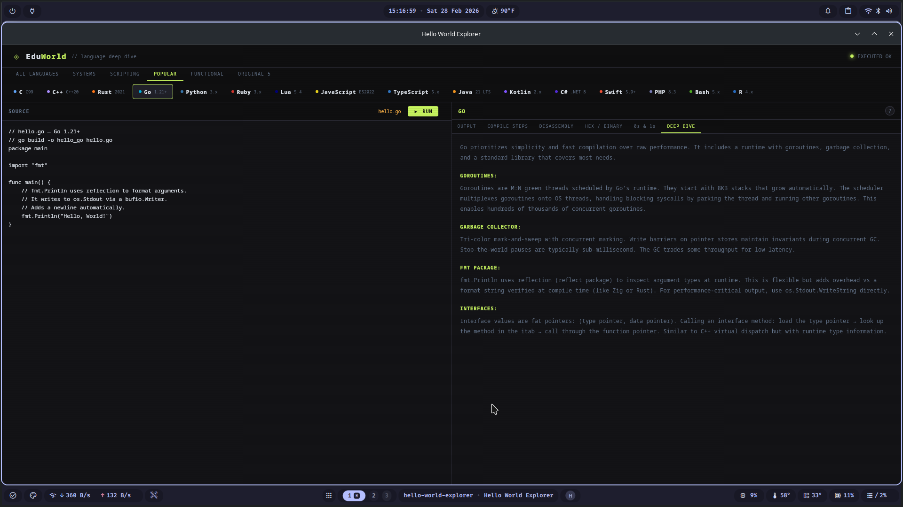

# EduWorld

> **Explore how programming languages actually work — from source code down to electrons.**

EduWorld is a desktop application that lets you pick any of 20+ programming languages and see exactly what happens under the hood: the source code, the full compilation pipeline, disassembly of the machine code, raw hex bytes on disk, how bits map to voltage signals, and a deep-dive essay covering the language's design decisions and runtime internals.

---

## Screenshots
## Screenshots



---

## Languages Covered

### Systems
| Language | Version | Runs In-App |
|---|---|---|
| x86-64 Assembly | NASM | ✅ compiled binary |
| C | C99 | ✅ compiled binary |
| C++ | C++20 | ✅ compiled binary |
| Rust | 2021 edition | ✅ compiled binary |
| Go | 1.21+ | ✅ compiled binary |
| Zig | 0.13+ | ✅ compiled binary |
| D | D2 | ✅ compiled binary |
| Odin | dev | ✅ compiled binary |
| Fortran | F90/2018 | ✅ compiled binary |

### Scripting
| Language | Version | Runs In-App |
|---|---|---|
| Python | 3.x | ✅ needs `python3` |
| Ruby | 3.x | ✅ needs `ruby` |
| Lua | 5.4 | ✅ needs `lua` |
| Perl | 5.x | ✅ needs `perl` |
| Bash | 5.x | ✅ pre-installed |
| PHP | 8.3 | ✅ needs `php` |
| R | 4.x | ✅ needs `Rscript` |

### Popular
| Language | Version | Runs In-App |
|---|---|---|
| JavaScript | ES2022 | ✅ needs `node` |
| TypeScript | 5.x | ✅ needs `ts-node` |
| Java | 21 LTS | ⚠️ see note |
| Kotlin | 2.x | ⚠️ see note |
| C# | .NET 8 | ⚠️ see note |
| Swift | 5.9+ | ⚠️ see note |

> ⚠️ Java, Kotlin, C#, and Swift require a full build toolchain to run. EduWorld shows their source, disassembly, and deep dive content — the RUN button displays install instructions for each.

---

## What Each Language Shows

- **SOURCE** — The actual hello world source file with comments explaining every line
- **COMPILE STEPS** — Every command and flag needed to go from source to executable, explained
- **DISASSEMBLY** — The machine code the CPU executes, shown as human-readable mnemonics
- **HEX / BINARY** — Raw bytes on disk: ELF headers, section layout, string data
- **0s & 1s** — How each layer translates the program from source → IR → opcodes → voltage
- **DEEP DIVE** — Language design decisions, runtime internals, history, and performance characteristics

---

## Building from Source

### Prerequisites

```bash
# Arch / CachyOS
sudo pacman -S rustup nodejs npm nasm gcc zig gcc-fortran go

# Rust toolchain
rustup default stable

# Tauri CLI
cargo install tauri-cli
```

### Build the language binaries

```bash
# From the project root
bash build-binaries.sh
```

This compiles all 9 pre-compiled language binaries into `src-tauri/binaries/`. D (`ldc2`) and Odin are skipped gracefully if not installed.

### Run in development

```bash
npm install
cargo tauri dev
```

### Build for release

```bash
cargo tauri build
```

Output: `src-tauri/target/release/hello-world-explorer`

### Optional — interpreter runtimes for scripted languages

```bash
sudo pacman -S ruby lua nodejs php r
npm install -g ts-node typescript
```

---

## Distribution

### Tarball (recommended — works everywhere)

```bash
mkdir -p EduWorld-linux-x64
cp src-tauri/target/release/hello-world-explorer EduWorld-linux-x64/eduworld
cp -r src-tauri/binaries EduWorld-linux-x64/
tar -czf EduWorld-linux-x64.tar.gz EduWorld-linux-x64/
```

Users run:
```bash
tar -xzf EduWorld-linux-x64.tar.gz
cd EduWorld-linux-x64 && ./eduworld
```


## Project Structure

```
eduworld/
├── frontend/
│   └── index.html          # Entire UI — all 20+ languages baked in, single file
├── src-tauri/
│   ├── src/
│   │   ├── main.rs          # Tauri entry point
│   │   └── lib.rs           # run_hello_world command — handles binary/interpreter/not-runnable
│   ├── binaries/            # Source files + compiled binaries (binaries gitignored)
│   ├── icons/               # App icons
│   ├── capabilities/        # Tauri v2 permission manifest
│   └── tauri.conf.json
├── flatpak/                 # Flatpak manifest + desktop entry + metainfo
├── build-binaries.sh        # Compiles all 9 pre-compiled language binaries
└── README.md
```

---

## Contributing

Pull requests welcome. If you want to add a language:

1. Add the source file to `src-tauri/binaries/hello.ext`
2. Add the execution mode to `lib.rs` (`exec_mode` match block)
3. Add the full language entry to `LANGS` in `frontend/index.html` — source, compile steps, disassembly, hex view, bits explanation, and deep dive
4. If it's a compiled language, add the build command to `build-binaries.sh`

---
